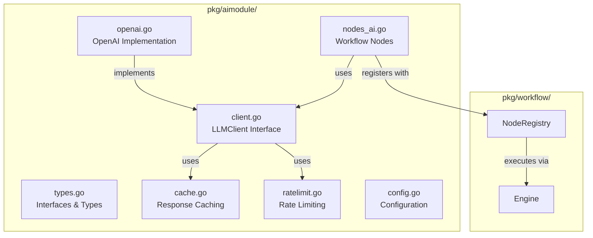

#AI Module Implementation Plan

## Overview

Tạo `pkg/aimodule/` - một AI module production-ready với multi-provider support, tool calling, caching, rate limiting, và workflow integration.

## Architecture




## Files to Create

### 1. Core Types & Interfaces

**File**: `pkg/aimodule/types.go`

- `Provider` enum (OpenAI, Anthropic, Ollama, Grok, Gemini, Custom)
- `LLMClient` interface với methods: `Chat()`, `Embed()`, `Provider()`
- `ChatRequest`, `ChatResponse`, `Message`, `Tool`, `ToolCall` structs
- `EmbedRequest`, `EmbedResponse` structs
- `Config`, `RateLimitConfig`, `CacheConfig` structs

### 2. Client Interface

**File**: `pkg/aimodule/client.go`

- Base `LLMClient` interface implementation
- Client factory function `NewClient(config Config) (LLMClient, error)`
- Provider registry để map provider -> implementation

### 3. OpenAI Implementation

**File**: `pkg/aimodule/openai.go`

- `OpenAIClient` struct implements `LLMClient`
- Sử dụng `github.com/sashabaranov/go-openai` SDK
- Support chat completions với tool calling
- Support embeddings
- Error handling và retry logic

### 4. Caching

**File**: `pkg/aimodule/cache.go`

- In-memory cache với TTL
- Cache key từ request hash
- Thread-safe implementation
- Optional: Redis cache interface (để extend sau)

### 5. Rate Limiting

**File**: `pkg/aimodule/ratelimit.go`

- Token bucket rate limiter
- Support requests per minute/day
- Per-provider rate limits
- Thread-safe

### 6. Workflow Nodes

**File**: `pkg/aimodule/nodes_ai.go`

- `AIChatNodeHandler` - Chat completion node
- `AIEmbedNodeHandler` - Embedding node  
- `AIToolCallNodeHandler` - Tool calling node
- Template rendering support (`{{ .input.field }}`)
- Integration với workflow `NodeInput`/`NodeOutput`

### 7. Configuration

**File**: `pkg/aimodule/config.go`

- `Init()` function để initialize default clients
- `DefaultClient()` để get default OpenAI client
- Environment variable support (API keys)
- Config loading từ FluxorContext

### 8. Node Registration

**File**: `pkg/aimodule/nodes.go`

- `RegisterNodes(registry workflow.NodeRegistry)` function
- Register các node types: `"aimodule.chat"`, `"aimodule.embed"`, `"aimodule.toolcall"`
- Integration point với workflow system

### 9. Tests

**Files**:

- `pkg/aimodule/openai_test.go`
- `pkg/aimodule/nodes_ai_test.go`
- `pkg/aimodule/cache_test.go`

### 10. Example Workflow

**File**: `examples/aimodule-workflow/main.go`

- Example workflow JSON với AI chat node
- Example với tool calling
- Example với embedding

## Implementation Details

### OpenAI Client (`openai.go`)

```go
type OpenAIClient struct {
    client *openai.Client
    config Config
    cache  *Cache
    limiter *RateLimiter
}

func (c *OpenAIClient) Chat(ctx context.Context, req ChatRequest) (*ChatResponse, error) {
    // 1. Check cache
    // 2. Check rate limit
    // 3. Call OpenAI API
    // 4. Cache response
    // 5. Return result
}
```


### Workflow Node Handler (`nodes_ai.go`)

```go
func AIChatNodeHandler(ctx context.Context, input *workflow.NodeInput) (*workflow.NodeOutput, error) {
    // 1. Get client from config or default
    // 2. Render prompt template
    // 3. Build ChatRequest
    // 4. Call client.Chat()
    // 5. Return NodeOutput với response
}
```


### Tool Calling Support

- Parse tools từ node config
- Execute tool calls
- Return results back to LLM
- Support multi-turn tool calling

## Integration Points

1. **Workflow Verticle**: Update `pkg/workflow/verticle.go` để call `aimodule.RegisterNodes(engine.registry)`
2. **Node Types**: Thêm node types mới vào `pkg/workflow/types.go` (optional, có thể dùng string literals)
3. **Dependencies**: `go-openai` đã được add vào `go.mod`

## Example Workflow JSON

```json
{
  "id": "customer-support-ai",
  "nodes": [
    {
      "id": "trigger",
      "type": "webhook"
    },
    {
      "id": "ai-chat",
      "type": "aimodule.chat",
      "config": {
        "provider": "openai",
        "model": "gpt-4o",
        "prompt": "Bạn là trợ lý MoMo. Trả lời: {{ .input.query }}",
        "temperature": 0.7,
        "tools": [...]
      },
      "next": ["response"]
    }
  ]
}
```


## Testing Strategy

1. Unit tests cho OpenAI client (với mock)
2. Integration tests cho workflow nodes
3. Example workflows để verify end-to-end

## Future Enhancements (Out of Scope)

- Ollama local support
- Anthropic client